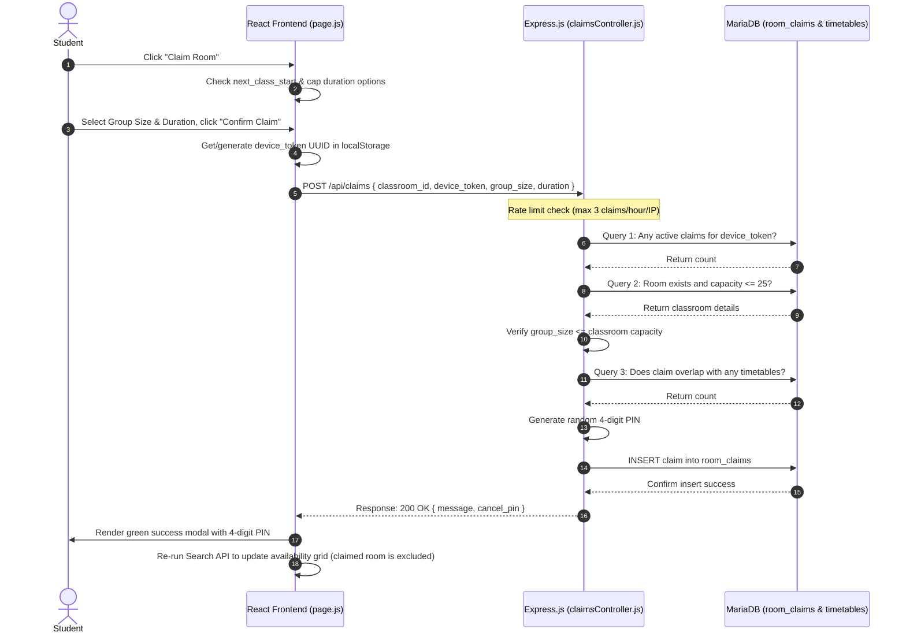

# Student Room Claiming System — Complete Implementation Guide

This document serves as the complete implementation guide for adding the **Student Room Claiming System** to the **Free Classroom Finder** application. 

---

## New Files & Folders

Below is the directory tree highlighting the new files added to the project:

```text
server/
└── src/
    ├── controllers/
    │   └── claimsController.js (NEW)
    └── routes/
        └── claims.js (NEW)
```

---

## Database Changes

### 1. New Table Schema: `room_claims`
Run the following SQL script to create the new `room_claims` table in your MariaDB database. It establishes foreign key constraints on `classrooms` and sets up columns to manage active claims and their cancellation PINs.

```sql
-- Create room_claims table
CREATE TABLE room_claims (
    claim_id INT AUTO_INCREMENT PRIMARY KEY,
    classroom_id INT NOT NULL,
    device_token VARCHAR(255) NOT NULL,
    group_size INT NOT NULL,
    start_time DATETIME NOT NULL,
    end_time DATETIME NOT NULL,
    cancel_pin VARCHAR(4) NOT NULL,
    FOREIGN KEY (classroom_id) REFERENCES classrooms(id) ON DELETE CASCADE
);

-- Performance index for active claims verification and searching
CREATE INDEX idx_active_claims ON room_claims(classroom_id, start_time, end_time);
CREATE INDEX idx_device_active_claims ON room_claims(device_token, start_time, end_time);
```

### 2. Updated Room Search Query
Update the room search query in the backend. It must exclude classrooms that are currently claimed (meaning the current time `NOW()` falls between a claim's `start_time` and `end_time`). It also selects the `next_class_start` (start time of the next official timetable entry for that classroom) using a subquery.

```sql
SELECT c.id, c.name AS room_name, c.capacity, c.room_type, b.name AS building_name,
       (SELECT MIN(t.start_time) 
        FROM timetables t 
        WHERE t.classroom_id = c.id 
          AND t.start_time >= ?) AS next_class_start
FROM classrooms c
JOIN buildings b ON c.building_id = b.id
WHERE c.id NOT IN (
    -- Exclude classrooms booked in official timetables
    SELECT classroom_id 
    FROM timetables
    WHERE start_time < ? 
      AND end_time > ?
)
AND c.id NOT IN (
    -- Exclude classrooms with an active claim
    SELECT classroom_id
    FROM room_claims
    WHERE NOW() BETWEEN start_time AND end_time
);
```

---

## Backend Changes

First, run `npm install express-rate-limit` inside the `server` directory.

### 1. [MODIFY] [server/src/index.js](file:///home/tumaini/Documents/ExternalProjects/CS-Project/fully-developed-classroom-finder/server/src/index.js)
Mount the claims route at `/api/claims`.

```javascript
const express = require('express');
const cors = require('cors');
require('dotenv').config();

const app = express();
const PORT = process.env.PORT || 5000;

// Middleware
app.use(cors({
    origin: ['http://localhost:3000', 'http://127.0.0.1:3000'],
    credentials: true
}));
app.use(express.json());
app.use(express.urlencoded({ extended: true }));

// Routing
app.use('/api/public', require('./routes/public'));
app.use('/api/claims', require('./routes/claims')); // NEW
app.use('/api/admin/auth', require('./routes/auth'));
app.use('/api/admin', require('./routes/admin'));

// Root Health Check
app.get('/', (req, res) => {
    res.json({ message: 'Free Classroom Finder API is active' });
});

// Error handling middleware
app.use((err, req, res, next) => {
    console.error('Unhandled server error:', err.stack);
    res.status(500).json({ error: err.message || 'Something went wrong on the server' });
});

app.listen(PORT, () => {
    console.log(`Server running on port ${PORT}`);
});
```

### 2. [MODIFY] [server/src/controllers/searchController.js](file:///home/tumaini/Documents/ExternalProjects/CS-Project/fully-developed-classroom-finder/server/src/controllers/searchController.js)
Update availability search logic to calculate and return `next_class_start` and filter out currently claimed rooms.

```javascript
const db = require('../config/db');

// Helper to convert day of week and time to datetime for conflict checking in the current week // NEW
function getDatetimeForDayAndTime(dayOfWeek, timeStr) { // NEW
    const days = ['Sunday', 'Monday', 'Tuesday', 'Wednesday', 'Thursday', 'Friday', 'Saturday']; // NEW
    const targetDayIndex = days.findIndex(d => d.toLowerCase() === dayOfWeek.toLowerCase()); // NEW
    if (targetDayIndex === -1) return null; // NEW
                                                                                           // NEW
    const now = new Date(); // NEW
    const currentDayIndex = now.getDay(); // NEW
    const diff = targetDayIndex - currentDayIndex; // NEW
                                                                                           // NEW
    const targetDate = new Date(now); // NEW
    targetDate.setDate(now.getDate() + diff); // NEW
                                                                                           // NEW
    const [hours, minutes] = timeStr.split(':'); // NEW
    targetDate.setHours(parseInt(hours, 10), parseInt(minutes, 10), 0, 0); // NEW
                                                                                           // NEW
    const year = targetDate.getFullYear(); // NEW
    const month = String(targetDate.getMonth() + 1).padStart(2, '0'); // NEW
    const date = String(targetDate.getDate()).padStart(2, '0'); // NEW
    return `${year}-${month}-${date} ${hours}:${minutes}:00`; // NEW
} // NEW

// Main availability search
async function searchAvailable(req, res) {
    const { day_of_week, start_time, end_time, capacity, room_type } = req.query;

    if (!day_of_week || !start_time || !end_time) {
        return res.status(400).json({ error: 'day_of_week, start_time, and end_time are required parameters' });
    }

    // Time validation (start_time < end_time)
    if (start_time >= end_time) {
        return res.status(400).json({ error: 'Start time must be strictly before end time' });
    }

    try {
        const searchStart = getDatetimeForDayAndTime(day_of_week, start_time); // NEW
        const searchEnd = getDatetimeForDayAndTime(day_of_week, end_time); // NEW
                                                                                           // NEW
        if (!searchStart || !searchEnd) { // NEW
            return res.status(400).json({ error: 'Invalid day of week parameter' }); // NEW
        } // NEW
                                                                                           // NEW
        let sql = `
            SELECT c.id, c.name AS room_name, c.capacity, c.room_type, b.name AS building_name,
                   (SELECT MIN(t.start_time) FROM timetables t WHERE t.classroom_id = c.id AND t.start_time >= ?) AS next_class_start // NEW
            FROM classrooms c
            JOIN buildings b ON c.building_id = b.id
            WHERE c.id NOT IN (
                SELECT classroom_id 
                FROM timetables
                WHERE start_time < ? // NEW
                  AND end_time > ? // NEW
            )
            AND c.id NOT IN ( // NEW
                SELECT classroom_id // NEW
                FROM room_claims // NEW
                WHERE NOW() BETWEEN start_time AND end_time // NEW
            ) // NEW
        `;
        const params = [searchStart, searchEnd, searchStart]; // NEW

        if (capacity) {
            const minCapacity = parseInt(capacity, 10);
            if (!isNaN(minCapacity)) {
                sql += ' AND c.capacity >= ?';
                params.push(minCapacity);
            }
        }

        if (room_type && room_type.trim() && room_type !== 'All') {
            sql += ' AND c.room_type = ?';
            params.push(room_type.trim());
        }

        sql += ' ORDER BY b.name ASC, c.name ASC';

        const [rows] = await db.query(sql, params);
        return res.json(rows);
    } catch (err) {
        console.error('Search available rooms error:', err);
        return res.status(500).json({ error: 'Internal server error performing classroom search' });
    }
}

// Get all unique room types currently in classrooms
async function getRoomTypes(req, res) {
    try {
        const [rows] = await db.query('SELECT DISTINCT room_type FROM classrooms ORDER BY room_type ASC');
        const types = rows.map(r => r.room_type);
        return res.json(types);
    } catch (err) {
        console.error('Get room types error:', err);
        return res.status(500).json({ error: 'Internal server error fetching room types' });
    }
}

module.exports = {
    searchAvailable,
    getRoomTypes
};
```

### 3. [NEW] [claims.js](file:///home/tumaini/Documents/ExternalProjects/CS-Project/fully-developed-classroom-finder/server/src/routes/claims.js)
Define routing for the claiming system. It rate limits IP requests to maximum 3 requests per hour.

```javascript
const express = require('express');
const router = express.Router();
const rateLimit = require('express-rate-limit');
const claimsController = require('../controllers/claimsController');

// Rate limiting middleware: max 3 claim requests per hour per IP
const claimLimiter = rateLimit({
    windowMs: 60 * 60 * 1000, // 1 hour
    max: 3,
    message: { error: 'Too many claims created from this IP. Please try again after an hour.' },
    standardHeaders: true,
    legacyHeaders: false,
});

// POST /api/claims
router.post('/', claimLimiter, claimsController.createClaim);

module.exports = router;
```

### 4. [NEW] [claimsController.js](file:///home/tumaini/Documents/ExternalProjects/CS-Project/fully-developed-classroom-finder/server/src/controllers/claimsController.js)
Processes room claims, enforces sequential business logic validations, generates random cancellation PINs, and inserts into `room_claims`.

```javascript
const db = require('../config/db');

// POST /api/claims
async function createClaim(req, res) {
    const { classroom_id, device_token, group_size, duration } = req.body;

    if (!classroom_id || !device_token || !group_size || !duration) {
        return res.status(400).json({ error: 'All fields (classroom_id, device_token, group_size, duration) are required.' });
    }

    try {
        // CHECK 1: Does this device_token already have an active claim? → 429 error
        const [existingClaims] = await db.query(
            'SELECT COUNT(*) AS count FROM room_claims WHERE device_token = ? AND NOW() BETWEEN start_time AND end_time',
            [device_token]
        );
        if (existingClaims[0].count > 0) {
            return res.status(429).json({ error: 'This device already has an active claim.' });
        }

        // Fetch classroom details
        const [rooms] = await db.query('SELECT capacity FROM classrooms WHERE id = ?', [classroom_id]);
        if (rooms.length === 0) {
            return res.status(404).json({ error: 'Classroom not found.' });
        }

        const roomCapacity = rooms[0].capacity;

        // CHECK 2: Is this room's capacity > 25? → 403 error
        if (roomCapacity > 25) {
            return res.status(403).json({ error: 'Only small classrooms (capacity <= 25) can be claimed.' });
        }

        // CHECK 3: Is group_size > room capacity? → 400 error
        if (parseInt(group_size, 10) > roomCapacity) {
            return res.status(400).json({ error: `Group size exceeds classroom capacity of ${roomCapacity}.` });
        }

        // Determine claim time window
        const startTime = new Date();
        // Maximum claim duration is 90 minutes regardless of what the frontend sends
        let durationMinutes = parseInt(duration, 10);
        if (isNaN(durationMinutes) || durationMinutes <= 0) {
            return res.status(400).json({ error: 'Invalid duration.' });
        }
        if (durationMinutes > 90) {
            durationMinutes = 90;
        }

        const endTime = new Date(startTime.getTime() + durationMinutes * 60000);

        // Helper to format Date into MariaDB YYYY-MM-DD HH:MM:SS (local time format)
        const formatMySQLDate = (d) => {
            const year = d.getFullYear();
            const month = String(d.getMonth() + 1).padStart(2, '0');
            const day = String(d.getDate()).padStart(2, '0');
            const hours = String(d.getHours()).padStart(2, '0');
            const minutes = String(d.getMinutes()).padStart(2, '0');
            const seconds = String(d.getSeconds()).padStart(2, '0');
            return `${year}-${month}-${day} ${hours}:${minutes}:${seconds}`;
        };

        const startTimeStr = formatMySQLDate(startTime);
        const endTimeStr = formatMySQLDate(endTime);

        // CHECK 4: Does the requested time window overlap with an official timetable entry? → 409 error
        // The check overlaps if timetables.start_time < endTime and timetables.end_time > startTime
        const [timetableConflicts] = await db.query(
            `SELECT COUNT(*) AS count 
             FROM timetables 
             WHERE classroom_id = ? 
               AND start_time < ? 
               AND end_time > ?`,
            [classroom_id, endTimeStr, startTimeStr]
        );
        if (timetableConflicts[0].count > 0) {
            return res.status(409).json({ error: 'The requested time window overlaps with an official timetable entry.' });
        }

        // Generate 4-digit PIN (random number between 1000 and 9999)
        const cancelPin = Math.floor(1000 + Math.random() * 9000).toString();

        // All checks pass, insert into room_claims
        await db.query(
            `INSERT INTO room_claims (classroom_id, device_token, group_size, start_time, end_time, cancel_pin)
             VALUES (?, ?, ?, ?, ?, ?)`,
            [classroom_id, device_token, group_size, startTimeStr, endTimeStr, cancelPin]
        );

        return res.json({
            message: 'Room claimed successfully.',
            cancel_pin: cancelPin
        });

    } catch (err) {
        console.error('Error creating room claim:', err);
        return res.status(500).json({ error: 'Internal server error processing the claim.' });
    }
}

module.exports = {
    createClaim
};
```

---

## Frontend Changes

First, run `npm install uuid` inside the `client` directory.

### 1. [MODIFY] [client/src/app/page.js](file:///home/tumaini/Documents/ExternalProjects/CS-Project/fully-developed-classroom-finder/client/src/app/page.js)
Update search page to include badges, the "Claim Room" button on small capacity cards, claim state management, and the confirmation modal with dynamic capping constraints.

```javascript
'use client';

import React, { useState, useEffect } from 'react';
import Link from 'next/link';
import Image from 'next/image';
import {
    Search,
    GraduationCap,
    Building2,
    CalendarRange,
    Clock,
    Users,
    SlidersHorizontal,
    ShieldAlert
} from 'lucide-react';
import { v4 as uuidv4 } from 'uuid'; // NEW

export default function SearchPage() {
    // Search Parameter states
    const [dayOfWeek, setDayOfWeek] = useState('Monday');
    const [startTime, setStartTime] = useState('08:00');
    const [endTime, setEndTime] = useState('10:00');
    const [capacity, setCapacity] = useState('');
    const [roomType, setRoomType] = useState('All');
    const [roomTypes, setRoomTypes] = useState([]);

    // Validation error state
    const [error, setError] = useState('');

    // Results states
    const [rooms, setRooms] = useState([]);
    const [filteredRooms, setFilteredRooms] = useState([]);
    const [loadingResults, setLoadingResults] = useState(false);
    const [searchError, setSearchError] = useState('');
    const [hasSearched, setHasSearched] = useState(false);

    // Client filtering & sorting states
    const [selectedBuilding, setSelectedBuilding] = useState('All');
    const [sortBy, setSortBy] = useState('name'); // name, capacity-desc, capacity-asc

    // Student room claiming states // NEW
    const [isClaimModalOpen, setIsClaimModalOpen] = useState(false); // NEW
    const [selectedRoomForClaim, setSelectedRoomForClaim] = useState(null); // NEW
    const [groupSize, setGroupSize] = useState(1); // NEW
    const [duration, setDuration] = useState(30); // NEW
    const [claimSuccess, setClaimSuccess] = useState(false); // NEW
    const [cancellationPin, setCancellationPin] = useState(''); // NEW
    const [claimError, setClaimError] = useState(''); // NEW
    const [isSubmittingClaim, setIsSubmittingClaim] = useState(false); // NEW

    // Fetch available classrooms based on current filters
    const fetchAvailableRooms = async (dayVal = dayOfWeek, startVal = startTime, endVal = endTime, capVal = capacity, typeVal = roomType) => {
        setLoadingResults(true);
        setSearchError('');
        try {
            const params = new URLSearchParams({
                day_of_week: dayVal,
                start_time: startVal,
                end_time: endVal
            });

            if (capVal) params.append('capacity', capVal);
            if (typeVal && typeVal !== 'All') params.append('room_type', typeVal);

            const res = await fetch(`http://localhost:5000/api/public/search/available?${params.toString()}`);
            if (!res.ok) {
                const data = await res.json();
                throw new Error(data.error || 'Failed to fetch search results');
            }
            const data = await res.json();
            setRooms(data);
            setFilteredRooms(data);
            setHasSearched(true);
        } catch (err) {
            console.error(err);
            setSearchError(err.message || 'Unable to load available classrooms.');
        } finally {
            setLoadingResults(false);
        }
    };

    // Initialize defaults and run initial search on mount
    useEffect(() => {
        const weekdays = ['Sunday', 'Monday', 'Tuesday', 'Wednesday', 'Thursday', 'Friday', 'Saturday'];
        const currentDayIndex = new Date().getDay();
        // If Sunday, default to Monday
        const defaultDay = currentDayIndex === 0 ? 'Monday' : weekdays[currentDayIndex];
        setDayOfWeek(defaultDay);

        const fetchRoomTypesAndInitialRooms = async () => {
            try {
                const res = await fetch('http://localhost:5000/api/public/room-types');
                if (res.ok) {
                    const data = await res.json();
                    setRoomTypes(data);
                }
            } catch (err) {
                console.error('Failed to fetch room types:', err);
            }

            // Run initial search automatically
            await fetchAvailableRooms(defaultDay, startTime, endTime, capacity, roomType);
        };

        fetchRoomTypesAndInitialRooms();
    }, []);

    // Apply sorting and building filtering client-side
    useEffect(() => {
        let result = [...rooms];

        if (selectedBuilding !== 'All') {
            result = result.filter(r => r.building_name === selectedBuilding);
        }

        if (sortBy === 'capacity-desc') {
            result.sort((a, b) => b.capacity - a.capacity);
        } else if (sortBy === 'capacity-asc') {
            result.sort((a, b) => a.capacity - b.capacity);
        } else {
            // Default sort by building and room name
            result.sort((a, b) => {
                const bCompare = a.building_name.localeCompare(b.building_name);
                if (bCompare !== 0) return bCompare;
                return a.room_name.localeCompare(b.room_name);
            });
        }

        setFilteredRooms(result);
    }, [rooms, selectedBuilding, sortBy]);

    const handleSearch = (e) => {
        e.preventDefault();
        setError('');

        if (startTime >= endTime) {
            setError('Start time must be strictly before end time.');
            return;
        }

        fetchAvailableRooms(dayOfWeek, startTime, endTime, capacity, roomType);
    };

    // Claim Event Handlers // NEW
    const handleOpenClaimModal = (room) => { // NEW
        setSelectedRoomForClaim(room); // NEW
        setGroupSize(1); // NEW
        const availableOptions = getFilteredDurations(room); // NEW
        setDuration(availableOptions.length > 0 ? availableOptions[0].value : 30); // NEW
        setClaimSuccess(false); // NEW
        setCancellationPin(''); // NEW
        setClaimError(''); // NEW
        setIsClaimModalOpen(true); // NEW
    }; // NEW

    const handleCloseClaimModal = () => { // NEW
        setIsClaimModalOpen(false); // NEW
        setSelectedRoomForClaim(null); // NEW
    }; // NEW

    // Dynamically filter duration dropdown options based on next official class // NEW
    const getFilteredDurations = (room) => { // NEW
        const allDurations = [ // NEW
            { label: '30 mins', value: 30 }, // NEW
            { label: '45 mins', value: 45 }, // NEW
            { label: '1 hr', value: 60 }, // NEW
            { label: '1.5 hrs', value: 90 }, // NEW
            { label: '2 hrs', value: 120 } // NEW
        ]; // NEW
        if (!room.next_class_start) return allDurations; // NEW

        const nextClassDate = new Date(room.next_class_start); // NEW
        const now = new Date(); // NEW
        const diffMinutes = Math.floor((nextClassDate - now) / 60000); // NEW

        return allDurations.filter(opt => opt.value <= diffMinutes); // NEW
    }; // NEW

    const handleConfirmClaim = async (e) => { // NEW
        e.preventDefault(); // NEW
        setClaimError(''); // NEW
        setIsSubmittingClaim(true); // NEW

        try { // NEW
            // Get or generate device token // NEW
            let deviceToken = localStorage.getItem('device_token'); // NEW
            if (!deviceToken) { // NEW
                deviceToken = uuidv4(); // NEW
                localStorage.setItem('device_token', deviceToken); // NEW
            } // NEW

            const response = await fetch('http://localhost:5000/api/claims', { // NEW
                method: 'POST', // NEW
                headers: { // NEW
                    'Content-Type': 'application/json', // NEW
                }, // NEW
                body: JSON.stringify({ // NEW
                    classroom_id: selectedRoomForClaim.id, // NEW
                    device_token: deviceToken, // NEW
                    group_size: groupSize, // NEW
                    duration: duration // NEW
                }), // NEW
            }); // NEW

            const data = await response.json(); // NEW
            if (!response.ok) { // NEW
                throw new Error(data.error || 'Failed to claim room'); // NEW
            } // NEW

            setCancellationPin(data.cancel_pin); // NEW
            setClaimSuccess(true); // NEW
            // Re-fetch rooms to update client view immediately // NEW
            fetchAvailableRooms(dayOfWeek, startTime, endTime, capacity, roomType); // NEW
        } catch (err) { // NEW
            console.error('Claim room error:', err); // NEW
            setClaimError(err.message || 'An error occurred while claiming the room.'); // NEW
        } finally { // NEW
            setIsSubmittingClaim(false); // NEW
        } // NEW
    }; // NEW

    const days = ['Monday', 'Tuesday', 'Wednesday', 'Thursday', 'Friday', 'Saturday', 'Sunday'];
    const buildings = ['All', ...new Set(rooms.map(r => r.building_name))];

    return (
        <div className="flex flex-col min-h-screen bg-slate-50">
            {/* Header / Navigation */}
            <header className="bg-blue-900 text-white shadow-md">
                <div className="max-w-7xl mx-auto px-4 sm:px-6 lg:px-8">
                    <div className="flex items-center justify-between h-16">
                        <div className="flex items-center space-x-3">
                            <Link href="/" className="flex items-center space-x-3">
                                <Image
                                    src="/strathmore-logo.png"
                                    alt="Free Classroom Finder Logo"
                                    width={120}
                                    height={43}
                                    className="h-11 w-auto object-contain"
                                    priority
                                />
                                <span className="font-bold text-xl tracking-tight">
                                    Free Classroom Finder
                                </span>
                            </Link>
                        </div>
                        <div>
                            <Link
                                href="/admin/login"
                                className="bg-blue-600 hover:bg-blue-700 text-white px-4 py-2 rounded-md text-sm font-medium transition-all-custom shadow"
                            >
                                Admin Login
                            </Link>
                        </div>
                    </div>
                </div>
            </header>

            {/* Main Content */}
            <main className="flex-grow max-w-7xl mx-auto w-full px-4 sm:px-6 lg:px-8 py-10">
                {/* Welcome / Intro */}
                <div className="text-center mb-8">
                    <h1 className="text-3xl font-extrabold text-slate-900 sm:text-4xl">
                        Find an Empty Classroom
                    </h1>
                    <p className="mt-2 text-slate-650 text-sm">
                        Search real-time classroom availability for study groups, lectures, or private study.
                    </p>
                </div>

                {/* Grid Split Layout */}
                <div className="grid grid-cols-1 lg:grid-cols-12 gap-8">
                    {/* Left Column: Search Parameters Form */}
                    <div className="lg:col-span-4 lg:order-last">
                        <div className="bg-white p-6 rounded-xl shadow-sm border border-slate-200/80 sticky top-6">
                            <h2 className="text-base font-bold text-slate-800 mb-4 flex items-center gap-2 border-b border-slate-100 pb-2">
                                <Search className="h-4.5 w-4.5 text-blue-600" /> Parameters
                            </h2>
                            <form onSubmit={handleSearch} className="space-y-5">
                                {error && (
                                    <div className="bg-rose-50 text-rose-600 p-3 rounded-md text-xs font-semibold border border-rose-100">
                                        {error}
                                    </div>
                                )}

                                {/* Day of the Week */}
                                <div>
                                    <label htmlFor="day" className="block text-xs font-semibold text-slate-700 mb-1.5 flex items-center gap-1.5">
                                        <CalendarRange className="h-3.5 w-3.5 text-blue-600" /> Day of Week
                                    </label>
                                    <select
                                        id="day"
                                        value={dayOfWeek}
                                        onChange={(e) => setDayOfWeek(e.target.value)}
                                        className="block w-full rounded-md border-slate-300 border p-2.5 bg-white focus:outline-none focus:ring-1 focus:ring-blue-500 focus:border-transparent text-slate-900 text-sm transition-all"
                                        required
                                    >
                                        {days.map((d) => (
                                            <option key={d} value={d}>{d}</option>
                                        ))}
                                    </select>
                                </div>

                                {/* Times grid */}
                                <div className="grid grid-cols-2 gap-4">
                                    <div>
                                        <label htmlFor="start_time" className="block text-xs font-semibold text-slate-700 mb-1.5 flex items-center gap-1.5">
                                            <Clock className="h-3.5 w-3.5 text-blue-600" /> Start Time
                                        </label>
                                        <input
                                            type="time"
                                            id="start_time"
                                            value={startTime}
                                            onChange={(e) => setStartTime(e.target.value)}
                                            className="block w-full rounded-md border-slate-300 border p-2.5 text-sm focus:outline-none focus:ring-1 focus:ring-blue-500 focus:border-transparent text-slate-900"
                                            required
                                        />
                                    </div>
                                    <div>
                                        <label htmlFor="end_time" className="block text-xs font-semibold text-slate-700 mb-1.5 flex items-center gap-1.5">
                                            <Clock className="h-3.5 w-3.5 text-blue-600" /> End Time
                                        </label>
                                        <input
                                            type="time"
                                            id="end_time"
                                            value={endTime}
                                            onChange={(e) => setEndTime(e.target.value)}
                                            className="block w-full rounded-md border-slate-300 border p-2.5 text-sm focus:outline-none focus:ring-1 focus:ring-blue-500 focus:border-transparent text-slate-900"
                                            required
                                        />
                                    </div>
                                </div>

                                {/* Optional Filters */}
                                <div className="border-t border-slate-100 pt-4 space-y-4">
                                    <h3 className="text-xs font-bold text-slate-500 uppercase tracking-wider flex items-center gap-1.5">
                                        <SlidersHorizontal className="h-3.5 w-3.5 text-blue-600" /> Filters (Optional)
                                    </h3>

                                    <div className="space-y-4">
                                        <div>
                                            <label htmlFor="building-filter" className="block text-xs font-semibold text-slate-700 mb-1 flex items-center gap-1">
                                                <Building2 className="h-3.5 w-3.5 text-blue-600" /> Building Location
                                            </label>
                                            <select
                                                id="building-filter"
                                                value={selectedBuilding}
                                                onChange={(e) => setSelectedBuilding(e.target.value)}
                                                className="block w-full rounded-md border-slate-300 border p-2.5 text-sm bg-white focus:outline-none focus:ring-1 focus:ring-blue-500 focus:border-transparent text-slate-900"
                                            >
                                                {buildings.map(b => (
                                                    <option key={b} value={b}>{b === 'All' ? 'All Buildings' : b}</option>
                                                ))}
                                            </select>
                                        </div>
                                        <div>
                                            <label htmlFor="capacity" className="block text-xs font-semibold text-slate-700 mb-1 flex items-center gap-1">
                                                <Users className="h-3.5 w-3.5 text-blue-600" /> Min Capacity
                                            </label>
                                            <input
                                                type="number"
                                                id="capacity"
                                                value={capacity}
                                                onChange={(e) => setCapacity(e.target.value)}
                                                placeholder="e.g. 30"
                                                min="1"
                                                className="block w-full rounded-md border-slate-300 border p-2.5 text-sm focus:outline-none focus:ring-1 focus:ring-blue-500 focus:border-transparent text-slate-900"
                                            />
                                        </div>
                                        <div>
                                            <label htmlFor="room_type" className="block text-xs font-semibold text-slate-700 mb-1 flex items-center gap-1">
                                                <Building2 className="h-3.5 w-3.5 text-blue-600" /> Room Type
                                            </label>
                                            <select
                                                id="room_type"
                                                value={roomType}
                                                onChange={(e) => setRoomType(e.target.value)}
                                                className="block w-full rounded-md border-slate-300 border p-2.5 text-sm bg-white focus:outline-none focus:ring-1 focus:ring-blue-500 focus:border-transparent text-slate-900"
                                            >
                                                <option value="All">All Types</option>
                                                {roomTypes.map((type) => (
                                                    <option key={type} value={type}>{type}</option>
                                                ))}
                                            </select>
                                        </div>
                                    </div>
                                </div>

                                <button
                                    type="submit"
                                    className="w-full flex justify-center items-center gap-2 bg-blue-600 hover:bg-blue-700 text-white font-semibold py-3 px-4 rounded-md transition-all-custom shadow hover:shadow-md focus:outline-none focus:ring-2 focus:ring-blue-500 focus:ring-offset-2 cursor-pointer text-sm"
                                >
                                    <Search className="h-4.5 w-4.5" /> Search Availability
                                </button>
                            </form>
                        </div>
                    </div>

                    {/* Right Column: Live Search Results */}
                    <div className="lg:col-span-8 lg:order-first space-y-6">
                        {/* Results Toolbar with filters/sorting */}
                        {hasSearched && !loadingResults && !searchError && rooms.length > 0 && (
                            <div className="bg-white p-4 rounded-xl border border-slate-200/70 shadow-sm flex flex-col sm:flex-row sm:items-center sm:justify-between gap-4">
                                <div className="text-sm font-semibold text-slate-600">
                                    Available Classrooms (<span className="text-blue-600">{filteredRooms.length}</span>)
                                </div>
                                <div className="flex items-center gap-3">
                                    <div>
                                        <select
                                            id="sort-by"
                                            value={sortBy}
                                            onChange={(e) => setSortBy(e.target.value)}
                                            className="rounded-md border-slate-300 border p-2 text-xs bg-white focus:outline-none focus:ring-1 focus:ring-blue-500 text-slate-900 font-medium"
                                        >
                                            <option value="name">Sort by Name</option>
                                            <option value="capacity-desc">Capacity: High to Low</option>
                                            <option value="capacity-asc">Capacity: Low to High</option>
                                        </select>
                                    </div>
                                </div>
                            </div>
                        )}

                        {/* Loading spinner */}
                        {loadingResults && (
                            <div className="bg-white rounded-xl border border-slate-200/70 shadow-sm p-16 flex flex-col items-center justify-center space-y-4">
                                <div className="animate-spin rounded-full h-10 w-10 border-b-2 border-blue-600"></div>
                                <p className="text-slate-500 text-sm font-semibold">Querying live space metrics...</p>
                            </div>
                        )}

                        {/* Error panel */}
                        {!loadingResults && searchError && (
                            <div className="bg-rose-50 border border-rose-100 text-rose-700 p-6 rounded-xl flex items-start gap-3">
                                <ShieldAlert className="h-6 w-6 text-rose-600 flex-shrink-0" />
                                <div>
                                    <h3 className="font-bold text-sm">Search Error</h3>
                                    <p className="text-xs mt-1 font-medium">{searchError}</p>
                                </div>
                            </div>
                        )}

                        {/* Empty/No available rooms state */}
                        {!loadingResults && !searchError && hasSearched && filteredRooms.length === 0 && (
                            <div className="bg-white rounded-xl border border-slate-200/70 shadow-sm p-16 text-center max-w-md mx-auto">
                                <ShieldAlert className="h-12 w-12 text-slate-400 mx-auto mb-4" />
                                <h3 className="font-bold text-slate-800 text-base">No Classrooms Available</h3>
                                <p className="text-slate-500 text-xs mt-2 leading-relaxed">
                                    {rooms.length === 0
                                        ? "All classrooms are currently booked or do not match your criteria for this time slot."
                                        : "No classrooms match the selected building filter."
                                    }
                                </p>
                                {rooms.length > 0 && selectedBuilding !== 'All' && (
                                    <button
                                        onClick={() => setSelectedBuilding('All')}
                                        className="mt-4 bg-slate-100 hover:bg-slate-200 text-slate-700 text-xs px-3.5 py-2 rounded-md font-semibold transition"
                                    >
                                        Clear Building Filter
                                    </button>
                                )}
                            </div>
                        )}

                        {/* Available Rooms Grid */}
                        {!loadingResults && !searchError && hasSearched && filteredRooms.length > 0 && (
                            <div className="grid grid-cols-1 sm:grid-cols-2 gap-6">
                                {filteredRooms.map((room) => (
                                    <div
                                        key={room.id}
                                        className="bg-white rounded-xl border border-slate-200/70 shadow-sm p-5 hover:shadow-md transition-all-custom flex flex-col justify-between"
                                    >
                                        <div>
                                            <div className="flex justify-between items-start gap-2 mb-3">
                                                <h3 className="font-bold text-slate-800 text-base truncate">{room.room_name}</h3>
                                                <span className="bg-emerald-50 text-emerald-700 text-[10px] font-bold px-2 py-0.5 rounded-full flex items-center gap-1 border border-emerald-100 flex-shrink-0">
                                                    <span className="w-1.5 h-1.5 bg-emerald-500 rounded-full animate-pulse"></span> Available
                                                </span>
                                            </div>

                                            <div className="space-y-2.5 mt-4 text-slate-650 text-xs">
                                                <div className="flex items-center gap-2">
                                                    <Building2 className="h-4 w-4 text-slate-400" />
                                                    <span>Building: <strong className="text-slate-700 font-semibold">{room.building_name}</strong></span>
                                                </div>
                                                <div className="flex items-center gap-2">
                                                    <Users className="h-4 w-4 text-slate-400" />
                                                    <span>Capacity: <strong className="text-slate-700 font-semibold">{room.capacity} seats</strong></span>
                                                </div>
                                                <div className="flex items-center gap-2">
                                                    <GraduationCap className="h-4 w-4 text-slate-400" />
                                                    <span>Type: <strong className="text-slate-700 font-semibold capitalize">{room.room_type}</strong></span>
                                                </div>
                                            </div>
                                        </div>

                                        <div className="border-t border-slate-100 mt-5 pt-3.5 flex justify-between items-center text-[10px] text-slate-400 font-medium">
                                            <span className="flex items-center gap-1">
                                                <Clock className="h-3.5 w-3.5 text-blue-500" /> Valid for: {dayOfWeek} {startTime} - {endTime}
                                            </span>
                                            {room.capacity > 25 ? ( // NEW
                                                <span className="bg-slate-100 text-slate-500 font-bold px-2 py-1 rounded text-[10px] border border-slate-200"> // NEW
                                                    Walk-in Only (Shared Space) // NEW
                                                </span> // NEW
                                            ) : ( // NEW
                                                <button // NEW
                                                    onClick={() => handleOpenClaimModal(room)} // NEW
                                                    className="bg-blue-600 hover:bg-blue-700 text-white font-bold px-3 py-1.5 rounded text-[10px] transition-colors cursor-pointer" // NEW
                                                > // NEW
                                                    Claim Room // NEW
                                                </button> // NEW
                                            )}
                                        </div>
                                    </div>
                                ))}
                            </div>
                        )}
                    </div>
                </div>
            </main>

            {/* Claim Modal */}
            {isClaimModalOpen && selectedRoomForClaim && ( // NEW
                <div className="fixed inset-0 bg-slate-900/50 backdrop-blur-sm flex items-center justify-center z-50 p-4"> // NEW
                    <div className="bg-white rounded-xl shadow-xl max-w-md w-full border border-slate-150 overflow-hidden"> // NEW
                        {/* Modal Header */} // NEW
                        <div className="bg-blue-900 text-white px-6 py-4 flex justify-between items-center"> // NEW
                            <h3 className="font-bold text-base">Claim Room: {selectedRoomForClaim.room_name}</h3> // NEW
                            <button // NEW
                                onClick={handleCloseClaimModal} // NEW
                                className="text-white/80 hover:text-white font-bold text-xl cursor-pointer" // NEW
                            > // NEW
                                &times; // NEW
                            </button> // NEW
                        </div> // NEW
                                                                                               // NEW
                        {/* Modal Body */} // NEW
                        <div className="p-6"> // NEW
                            {claimSuccess ? ( // NEW
                                <div className="text-center space-y-4"> // NEW
                                    <div className="inline-flex items-center justify-center w-12 h-12 rounded-full bg-emerald-100 text-emerald-600 mb-2"> // NEW
                                        <svg className="w-6 h-6" fill="none" stroke="currentColor" viewBox="0 0 24 24"> // NEW
                                            <path strokeLinecap="round" strokeLinejoin="round" strokeWidth="2" d="M5 13l4 4L19 7" /> // NEW
                                        </svg> // NEW
                                    </div> // NEW
                                    <h4 className="font-bold text-slate-800 text-lg">Room Claimed!</h4> // NEW
                                    <p className="text-sm text-slate-650"> // NEW
                                        You have successfully claimed <strong>{selectedRoomForClaim.room_name}</strong>. // NEW
                                    </p> // NEW
                                    <div className="bg-slate-50 border border-slate-200/60 rounded-lg p-4 max-w-xs mx-auto"> // NEW
                                        <span className="block text-[10px] text-slate-400 font-semibold uppercase tracking-wider">Cancellation PIN</span> // NEW
                                        <span className="block text-3xl font-extrabold text-blue-900 tracking-widest mt-1">{cancellationPin}</span> // NEW
                                        <span className="block text-[9px] text-rose-500 mt-2 font-medium">Keep this PIN. You will need it to cancel this claim.</span> // NEW
                                    </div> // NEW
                                    <button // NEW
                                        onClick={handleCloseClaimModal} // NEW
                                        className="bg-blue-600 hover:bg-blue-700 text-white font-semibold py-2.5 px-6 rounded-md transition-colors w-full cursor-pointer text-sm shadow" // NEW
                                    > // NEW
                                        Done // NEW
                                    </button> // NEW
                                </div> // NEW
                            ) : ( // NEW
                                <form onSubmit={handleConfirmClaim} className="space-y-5"> // NEW
                                    {claimError && ( // NEW
                                        <div className="bg-rose-55 text-rose-650 p-3 rounded-md text-xs font-semibold border border-rose-100"> // NEW
                                            {claimError} // NEW
                                        </div> // NEW
                                    )} // NEW
                                                                                                           // NEW
                                    {/* Info Panel */} // NEW
                                    <div className="bg-blue-50 border border-blue-100 rounded-lg p-3 text-xs text-blue-800"> // NEW
                                        <p>Max claim duration is 90 minutes. Active claim duration is automatically verified.</p> // NEW
                                        {selectedRoomForClaim.next_class_start && ( // NEW
                                            <p className="mt-1 font-semibold text-amber-700"> // NEW
                                                Next official class: {new Date(selectedRoomForClaim.next_class_start).toLocaleTimeString([], {hour: '2-digit', minute:'2-digit'})} // NEW
                                            </p> // NEW
                                        )} // NEW
                                    </div> // NEW
                                                                                                           // NEW
                                    {/* Group Size selection */} // NEW
                                    <div> // NEW
                                        <label htmlFor="modal_group_size" className="block text-xs font-semibold text-slate-700 mb-1.5"> // NEW
                                            Group Size (Max {selectedRoomForClaim.capacity}) // NEW
                                        </label> // NEW
                                        <select // NEW
                                            id="modal_group_size" // NEW
                                            value={groupSize} // NEW
                                            onChange={(e) => setGroupSize(parseInt(e.target.value, 10))} // NEW
                                            className="block w-full rounded-md border-slate-350 border p-2.5 bg-white text-slate-905 text-sm focus:outline-none focus:ring-1 focus:ring-blue-500" // NEW
                                            required // NEW
                                        > // NEW
                                            {Array.from({ length: selectedRoomForClaim.capacity }, (_, i) => i + 1).map((size) => ( // NEW
                                                <option key={size} value={size}>{size} {size === 1 ? 'person' : 'people'}</option> // NEW
                                            ))} // NEW
                                        </select> // NEW
                                    </div> // NEW
                                                                                                           // NEW
                                    {/* Duration selection */} // NEW
                                    <div> // NEW
                                        <label htmlFor="modal_duration" className="block text-xs font-semibold text-slate-700 mb-1.5"> // NEW
                                            Claim Duration // NEW
                                        </label> // NEW
                                        {getFilteredDurations(selectedRoomForClaim).length > 0 ? ( // NEW
                                            <select // NEW
                                                id="modal_duration" // NEW
                                                value={duration} // NEW
                                                onChange={(e) => setDuration(parseInt(e.target.value, 10))} // NEW
                                                className="block w-full rounded-md border-slate-350 border p-2.5 bg-white text-slate-905 text-sm focus:outline-none focus:ring-1 focus:ring-blue-500" // NEW
                                                required // NEW
                                            > // NEW
                                                {getFilteredDurations(selectedRoomForClaim).map((opt) => ( // NEW
                                                    <option key={opt.value} value={opt.value}>{opt.label}</option> // NEW
                                                ))} // NEW
                                            </select> // NEW
                                        ) : ( // NEW
                                            <div className="text-xs text-rose-600 bg-rose-50 border border-rose-100 rounded-md p-3 font-semibold"> // NEW
                                                This room cannot be claimed because the next official class starts in less than 30 minutes. // NEW
                                            </div> // NEW
                                        )} // NEW
                                    </div> // NEW
                                                                                                           // NEW
                                    {/* Action Buttons */} // NEW
                                    <div className="flex gap-3 pt-2"> // NEW
                                        <button // NEW
                                            type="button" // NEW
                                            onClick={handleCloseClaimModal} // NEW
                                            className="flex-1 bg-slate-100 hover:bg-slate-200 text-slate-700 font-semibold py-2.5 rounded-md transition-colors cursor-pointer text-sm" // NEW
                                        > // NEW
                                            Cancel // NEW
                                        </button> // NEW
                                        <button // NEW
                                            type="submit" // NEW
                                            disabled={isSubmittingClaim || getFilteredDurations(selectedRoomForClaim).length === 0} // NEW
                                            className="flex-1 bg-blue-600 hover:bg-blue-700 disabled:bg-blue-300 text-white font-semibold py-2.5 rounded-md transition-colors cursor-pointer text-sm shadow flex justify-center items-center gap-2" // NEW
                                        > // NEW
                                            {isSubmittingClaim ? ( // NEW
                                                <> // NEW
                                                    <span className="w-4 h-4 border-2 border-white border-t-transparent rounded-full animate-spin"></span> // NEW
                                                    Claiming... // NEW
                                                </> // NEW
                                            ) : ( // NEW
                                                'Confirm Claim' // NEW
                                            )} // NEW
                                        </button> // NEW
                                    </div> // NEW
                                </form> // NEW
                            )} // NEW
                        </div> // NEW
                    </div> // NEW
                </div> // NEW
            )} // NEW

            {/* Footer */}
            <footer className="bg-slate-100 border-t border-slate-200 py-6 text-center text-slate-500 text-sm">
                &copy; {new Date().getFullYear()} Strathmore University Free Classroom Finder. For educational institutions and study groups.
            </footer>
        </div>
    );
}
```

---

## Step-by-Step Implementation Order

Follow this exact order to implement the claiming system without breaking the application:

1. **Step 1: Install Dependencies**
   - In the frontend (`client` folder), run:
     ```bash
     npm install uuid
     ```
   - In the backend (`server` folder), run:
     ```bash
     npm install express-rate-limit
     ```

2. **Step 2: Database Migration**
   - Connect to your MariaDB instance and run the `room_claims` creation script shown in [Database Changes](#database-changes).

3. **Step 3: Create Claims Controller**
   - Create the new file [claimsController.js](file:///home/tumaini/Documents/ExternalProjects/CS-Project/fully-developed-classroom-finder/server/src/controllers/claimsController.js) and paste the complete code block.

4. **Step 4: Create Claims Router**
   - Create the new file [claims.js](file:///home/tumaini/Documents/ExternalProjects/CS-Project/fully-developed-classroom-finder/server/src/routes/claims.js) and paste the routing code containing the express rate limiter setup.

5. **Step 5: Register Claims Endpoint in Main Server**
   - Edit [index.js](file:///home/tumaini/Documents/ExternalProjects/CS-Project/fully-developed-classroom-finder/server/src/index.js) to import and mount the new claims router under `/api/claims`.

6. **Step 6: Update Availability Search Controller**
   - Edit [searchController.js](file:///home/tumaini/Documents/ExternalProjects/CS-Project/fully-developed-classroom-finder/server/src/controllers/searchController.js) with the helper function and the updated SQL query to exclude active claims and select `next_class_start`.

7. **Step 7: Update React Frontend Component**
   - Edit [page.js](file:///home/tumaini/Documents/ExternalProjects/CS-Project/fully-developed-classroom-finder/client/src/app/page.js) to import `uuid`, handle the claim modal states, calculate the dynamic durations, and show the cancellation PIN.

---

## How It All Connects

Here is the flow of data across the stack when a student claims a room:



1. **User Request**: The student finds an available room with capacity $\le 25$ on the results page and clicks **Claim Room**.
2. **Capping Calculations**: React calculates the difference between `NOW()` and `next_class_start` (returned by search API). If an official class starts soon, options longer than the available time window are removed from the duration dropdown.
3. **Confirm & Store**: On confirmation, React checks `localStorage` for a `device_token` (UUID). If absent, a new one is generated via `uuid` and stored. The request is dispatched.
4. **Rate Limiting & Safety**: Express limits claims per IP using `express-rate-limit`. The controller runs sequential checks: device claims limit, capacity restriction, group size limits, and overlaps with the `timetables` table (assuming `DATETIME` columns).
5. **Database & PIN Return**: A 4-digit PIN is generated. The record is inserted into `room_claims` with `start_time = NOW()` and `end_time = NOW() + duration` (up to 90 mins).
6. **UI Finish**: The student sees the confirmation screen showing the PIN. The search page automatically triggers a refresh, filtering out the claimed room.
