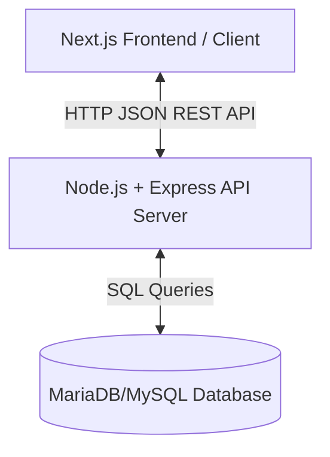

# Free Classroom Finder - System Guide

Welcome to the technical system guide for the **Free Classroom Finder**. This document explains the architecture of the application, maps out how each folder and file works, and walks through a complete trace of the request-response cycle when a student claims a classroom.

---

## 1. High-Level Architecture

The system uses a modern **Client-Server Model**:



- **Frontend (Client)**: Built with **Next.js** (App Router), styled using Tailwind CSS, and uses Lucide Icons. It handles student searching, claiming, active claim viewing, and admin management.
- **Backend (Server)**: A **Node.js** + **Express** server. It exposes REST API endpoints for both students (public search/claims) and administrators (timetable insertion, stats, claim revokes).
- **Database**: Relational database (MariaDB/MySQL) storing schools, courses, groups, lecturers, classrooms, timetables, and student claims.

---

## 2. Directory and File Breakdown

### Backend (`/server`)
- [`src/index.js`](file:///home/tumaini/Documents/ExternalProjects/CS-Project/fully-developed-classroom-finder/server/src/index.js): Entry point of the Express API server. Mounts middleware (CORS, body parser), registers router files, and checks the database schema on start-up.
- [`src/config/db.js`](file:///home/tumaini/Documents/ExternalProjects/CS-Project/fully-developed-classroom-finder/server/src/config/db.js): Setup for the database connection pool using the `mysql2/promise` driver.
- [`src/config/schema.sql`](file:///home/tumaini/Documents/ExternalProjects/CS-Project/fully-developed-classroom-finder/server/src/config/schema.sql): Defines the table structures (`schools`, `classrooms`, `timetables`, `room_claims`, etc.) and basic indexing.
- [`src/config/seed.js`](file:///home/tumaini/Documents/ExternalProjects/CS-Project/fully-developed-classroom-finder/server/src/config/seed.js): Seeds the database by parsing university records (rooms, buildings, groups) and inserting them.
- [`src/routes/`](file:///home/tumaini/Documents/ExternalProjects/CS-Project/fully-developed-classroom-finder/server/src/routes/):
  - `public.js`: Public routes for classroom searches (`/search/available`) and fetching metadata.
  - `claims.js`: Routes for creating claims, cancelling claims, and retrieving current student claims.
  - `admin.js`: Protected routes requiring JWT authentication for administrative dashboard tasks.
- [`src/controllers/`](file:///home/tumaini/Documents/ExternalProjects/CS-Project/fully-developed-classroom-finder/server/src/controllers/):
  - `searchController.js`: Handles searching for open rooms on a day and time slot.
  - `claimsController.js`: Contains business validation checks for creating, listing, and cancelling room claims.

### Frontend (`/client`)
- [`src/app/page.js`](file:///home/tumaini/Documents/ExternalProjects/CS-Project/fully-developed-classroom-finder/client/src/app/page.js): The main student landing page. Contains filters for building, room capacity, search times, the availability results grid, and the claim booking modal.
- [`src/app/claimed-rooms/page.js`](file:///home/tumaini/Documents/ExternalProjects/CS-Project/fully-developed-classroom-finder/client/src/app/claimed-rooms/page.js): The student's "My Claimed Rooms" dashboard. Shows their active bookings with cancellation PINs.
- [`src/app/admin/claimed-rooms/page.js`](file:///home/tumaini/Documents/ExternalProjects/CS-Project/fully-developed-classroom-finder/client/src/app/admin/claimed-rooms/page.js): Administrative dashboard for viewing, searching, and revoking claims.

---

## 3. Step-by-Step Code Flow: Booking a Classroom

Below is the chronological path of code execution when a student claims a room.

### Step 1: Client Initialization
- **File**: `client/src/app/page.js`
- **Code**:
  - The page loads. `useEffect` runs, checking if the browser has a `device_token` in `localStorage`. If not, it generates a unique UUID using `uuidv4()` and stores it.
  - Checks current system time. If it is after class hours (e.g. 8:30 PM), it automatically shifts the default search parameters to tomorrow morning at `08:15`–`09:15`.

### Step 2: Classroom Search
- **File**: `client/src/app/page.js` -> `server/src/controllers/searchController.js`
- **Code**:
  - `fetchAvailableRooms` makes a GET request to `/api/public/search/available?day_of_week=Monday&start_time=08:15&end_time=09:15`.
  - The backend server's `searchAvailable` controller verifies that the requested search times are within active class hours (`08:15` to `17:15`).
  - Calls `getDatetimeForDayAndTime` to format slot datetimes. If the slot has already passed today, it rolls it over to the upcoming week (adding 7 days).
  - Queries classrooms, filtering out rooms that have overlapping official timetables or active student claims during that slot. Returns the available list.

### Step 3: Opening the Booking Modal
- **File**: `client/src/app/page.js`
- **Code**:
  - The student clicks the **Claim Room** button on a free room card.
  - `handleOpenClaimModal(room)` is invoked, opening the claim modal and pre-filling the booking day, start time, and end time to match the student's active search slot.

### Step 4: Submission
- **File**: `client/src/app/page.js`
- **Code**:
  - The student inputs their **Group Size** and clicks **Confirm Claim**.
  - `handleConfirmClaim` triggers, sending a POST request to `/api/claims` containing:
    ```json
    {
      "classroom_id": 62,
      "device_token": "f4c1d04c-9a8d-4424-803e-2ea647dc69cb",
      "group_size": 5,
      "day_of_week": "Monday",
      "start_time": "10:15",
      "end_time": "11:00"
    }
    ```

### Step 5: Backend Claims Validation & Creation
- **File**: `server/src/controllers/claimsController.js`
- **Code**:
  1. **Fields Check**: Verifies all required body arguments exist.
  2. **Active Hours Check**: Checks if times are between `08:15` and `17:15`.
  3. **Capacity Check**: Queries the classroom capacity. If capacity > 25, blocks booking (`403 Forbidden`) as large rooms are walk-in only.
  4. **Group Size Check**: Asserts `group_size` <= room capacity.
  5. **Time Formats**: Calculates full datetimes for the slot using `getDatetimeForDayAndTime`. If the slot is in the past today, it rolls over to next week (adds 7 days).
  6. **Overlap Checks**:
     - Checks if the classroom already has an overlapping claim in the `room_claims` table.
     - Checks if this student's `device_token` has an overlapping claim.
     - Checks if the slot conflicts with any scheduled class in the `timetables` table.
  7. **IP Logging**: Captures the student's client IP address (`req.ip` / `x-forwarded-for`).
  8. **Insertion**: Generates a random 4-digit PIN, inserts the claim row, and returns a JSON response containing the cancellation PIN.

### Step 6: Confirmation
- **File**: `client/src/app/page.js`
- **Code**:
  - The client receives the `200 OK` response with the 4-digit PIN.
  - The modal updates to show the successful booking details and displays the cancellation PIN.
